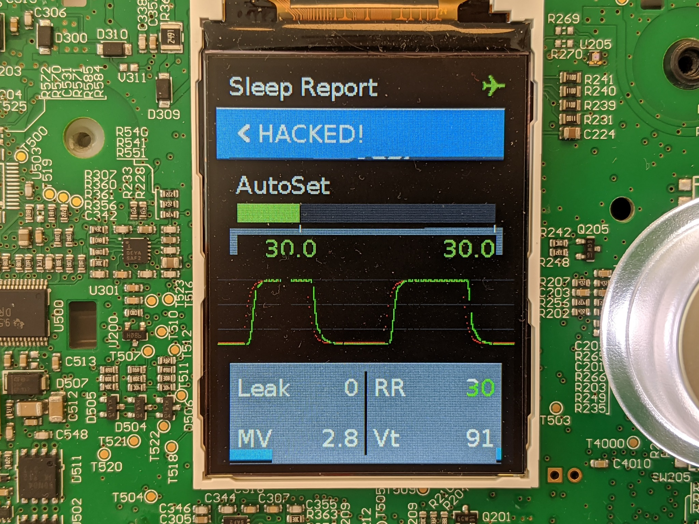

# Airbreak

The Airsense 10 CPAP (Constant Positive Airway Pressure) machine
is a common, low-cost sleep therapy device intended to treat sleep apnea and
other respiratory disorders.  

In light of the COVID-19 crisis and resultant shortage of medical equipment,
[hospitals have been using BiPAP (BIlevel Positive Airway Pressure) machines as non-invasive ventilators](https://health.mountsinai.org/blog/mount-sinai-turns-hundreds-of-machines-for-sleep-apnea-into-hospital-ventilators-shares-instructions-worldwide/),
and [several groups](https://github.com/PubInv/covid19-vent-list) are currently working on ventilator designs that involve a converted BiPAP.
CPAP devices are cheaper, more widely available, and similar electrically and mechanically. However, they are not considered useful; 
according to their manufacturer, CPAP machines "[*would require significant rework in order to function as a ventilator*](https://www.resmed.com/en-us/covid-19/)".

What we have done it to "*jailbreak*" the CPAP machine so that it
is possible to run additional tasks on the device to add the features

necessary to use the device as a temporary ventilator.  This can help ease
the shortage until more real ventilators are available.

Our changes bring the Airsense S10 to near feature parity with BiPAP machines from the same manufacturer, boost the maximum pressure output available, and provide a starting point to add more advanced emergency ventilator functionality.

## Disclaimer

While we are consulting with doctors to validate that the modified firmware works as intended, the codebase in its current form should be considered
a proof of concept and is not intended for use in a life-support capacity.  

No IP belonging to the device manufacturer is hosted in this repository, nor will it be accepted as a pull request.

## Major features:
* Adds a timed breathing mode that oscillates between high and low pressure (stock firmware is only a single pressure)
* Allows maximum pressure to be increased to 30 cm H2O (stock firmware is 20cm H2O)
* Allows very smooth rapid pressure change rates (stock firmware ramps 1 cm/sec)
* Unlocks all of the vendor modes and tunable configuration parameters
* Access to all of the sensors (flow, pressure, temperature, etc)
* Reads tuning parameters from a memory location accessible over SWD
* Real-time data export over SWD
* Real-time graphs on the screen to show an immediate history of data

## Features under development:
* Closed loop air pressure control with backup respiration rates ("VAPS" mode)
* Visual and audible alarms when flow stoppage or leakage rates are detected
* GPIO interface with other systems

# FAQ

## What's the difference between the CPAP and BiPAP machines?
The Airsense 10 that we have modified is a low cost sleep therapy device that
provides a *Constant* air pressure to help with sleep apnea and other disorders.
The BiPAP machines can produce two levels of pressure, which allows them to
be used a temporary ventilators.  Adding a function to the existing firmware
that alternate between pressures allows the CPAP to effectively function
similar to a BiPAP system.

## Can this be used to treat COVID patients?
We want to be very clear here: this modified firmware should not be
flashed on CPAP machines and used to treat COVID patients immediately.
The firmware that we've developed is an effective demonstration of
the capability, and while it has been reviewed and validated by expert
researchers, biomedical engineers, and clinical pulmonologists, it has
not yet been put through FDA approval.  Additionally, the
[Mt Sinai's protocols for off-label non-invasive ventilation](https://health.mountsinai.org/wp-content/uploads/sites/14/2020/04/NIV-to-Ventilator-Modification-Protocol-v1.02-for-posting.pdf)
require additional modifications such as viral filter and remote control
before the machines are ready for clinical use.

## Could this sort of hack alleviate the shortage of ventilators?
If the manufacturers developed their own firmware updates, or the FDA
approves the jailbroken ones, this could have an extremely large role
in bridging the ventilator shortage gap.
There are millions of unused or underutilized CPAP and BiPAP devices sitting in
closets in America, and roughly another 500,000 units in warehouses in
the country.  These devices can be used as an alternate ventilator, for
low-resource hospitals who are still waiting for the hospital ventilators
to arrive.

## Could this go through FDA approval?
If there were no other option it could, but we believe that the best
route for rolling out these upgrades is to work with the manufacturers
to use their resources to validate and distribute these upgrades safely
and at scale.  There are three main factors at play here:

* The first is a regulatory/safety one:  Under the recently-released
FDA guidance on hardware and software modification of CPAP and BiPAP
devices to treat COVID patients, the manufacturer has a carte blanche
to release an updated version of their firmware for their own devices
without requiring explicit FDA approval -- they are in the best position
from a technical, expertise, safety and regulatory perspective.

* The second is a practical one:  There are lots of different models of
CPAP and BiPAP devices, and reverse-engineering is a slow and painful
process. We modified the most common model of CPAP in America, but to
get lots of ventilators quickly, you'd need a firmware modification for
every mode of CPAP. What we've found in our work is that the work needed
for the manufacturer to implement these upgrades is pretty minimal --
the manufacturer has access to the source code, to the schematics,
and to the engineers who are intimately familiar with physiology and
safety standards.  We've found that, in many cases, the bulk of the
work is already done and through FDA, like the iVAPS menu that
is in the firmware on the ResMed Airsense device.  Even if other
manufacturers had not written a line of code for their CPAP models, the
simple pressure-control ventilator mode that we were able to implement
is very simple to develop, is designed to work on every CPAP device in
existence, and would be a very low technology and regulatory barrier
for manufacturers who have the right people and resources.

* The third is related to making these jailbreaks at scale:  We could take
in every unused CPAP device in the country, [unscrew the case and
re-flash the firmware](Installation).  It's slow and expensive but could
be solved with lots and lots of people.  The thing is, of the 8 million
CPAPs in the country, almost all 5 million shipped over the last 3 years
have a cellular IoT connection that is always on, reporting back usage
information to the doctors and the insurance companies.  That cellular
connection also has over-the-air upgrade capability that can only be
accessed from within the IT infrastructure of the device manufacturers.
This is a big deal -- it means that they can selectively upgrade, by
serial number, specific units to function as ventilators, without having
to open them up -- it can all work over the air.

## So what's the point?

What our firmware does is show that it is possible to re-program these
devices in a way that doctors can use to effectively ventilate COVID
patients. We have been able to confirm the functionality of the devices
in instrumented patient circuits operated by experts in pulmonological
measurement. And there are doctors who agree that, if they had an
FDA-approved machine that could that can do what these machines are doing,
then they could use them to clinically ventilate COVID patients in an ICU.

We do have a path to get this firmware through FDA, and we would apply for
FDA approval under the Emergency Use Authorization if the manufacturers
absolutely refused to cooperate, but the safest and best path is for
the manufacturers to enable this upgrade on their own.

Device owners can also use these tools to write their own [extensions to customize
their devices for their needs](info/extensions), similar to [Magic Lantern](https://magiclantern.fm)
for cameras, as well as the better understand their own therapy by gaining
access to the sensors on the device.  They can add features like the on-screen
graphs shown above, or integrate external systems through the expansion port.

# Evaluation

To be written.  Currently the modified firmware is being evaluated by
research labs and pulmnologists.  There are other pieces necessary to
use the devices in a clinical setting, such as filter traps, O2 inputs,
alarms, etc.

[Mt Sinai's BiPAP protocols for non-invasive ventilation](https://health.mountsinai.org/wp-content/uploads/sites/14/2020/04/NIV-to-Ventilator-Modification-Protocol-v1.02-for-posting.pdf)
provide a roadmap for how these modified CPAP devices could be used.

# More details

* [Installation guide](/disassembly)
* [Writing extensions](info/extensions)
