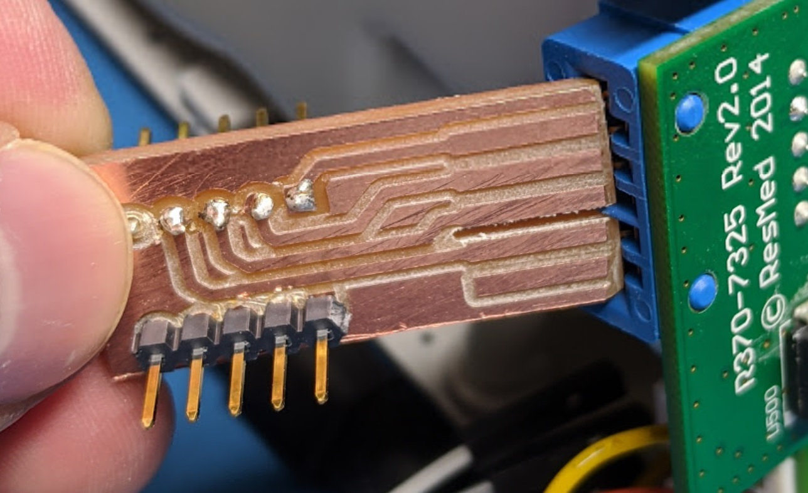
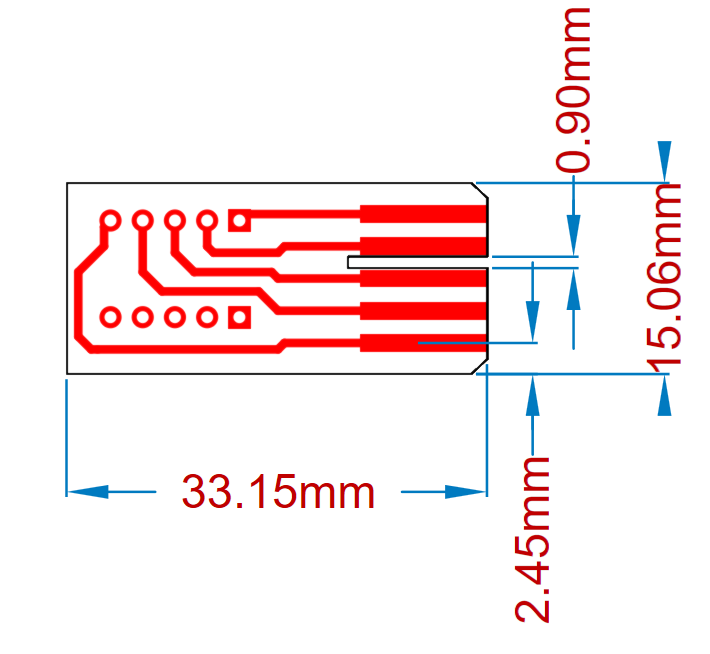
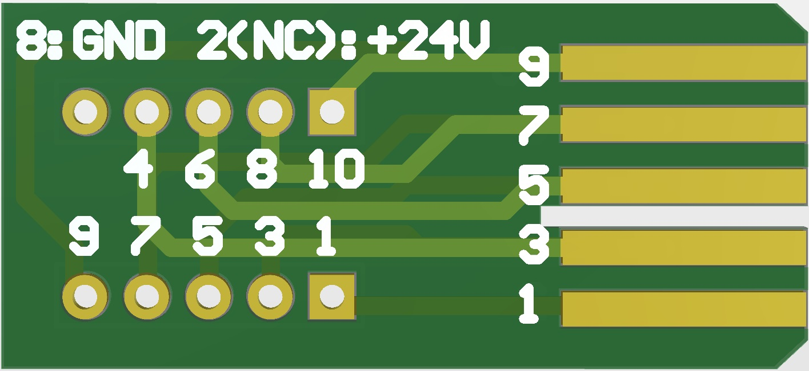

# Accessory Board Edge Connector Breakout

Small PCB that fits into the accessory port on the side. Originally designed for building out the monitor USART connection.

This board is designed to be millable on a Bantam PCB mill so makes some odd-looking PCB design choices. As there is no PTH you'll notice headers were put on each side in photo below. You will need to use both 1/32" and 1/64" end mills.

You can freely send the board away to be made of course too.

**WARNING**: Sanding FR4 material creates dangerous dust. If you need to bevel the edge use appropriate precautions such as sanding under water.

## PCB Source Format

PCB design files are in Altium Designer source (sorry).

### Sizes

The card edge dimensions are roughly based on a standard card-edge, see [example connector spec that includes PCB sizes](https://media.digikey.com/pdf/Data%20Sheets/Panasonic%20Electric%20Works%20PDFs/AXC.pdf).

Board should be 15 mm width (or a little less). The gerber files have a small board outline width to ensure Bantam software gives correct edge size (otherwise may mill on outside edge).

The connectors are on 2.54mm (0.100" grid). Other spacing shown below:

## Pinout Notes

See pinout stored in rest of project, the following shows pinout of hedaers relative to pin numbers marked on main-board part number:

Note that pin 2 is +24V and is NOT connected to the header. Add the wire if you need it, but assumed more people will be sad-face about brushing +24V against their 3.3V USART adapter than would use the +24V for debug.