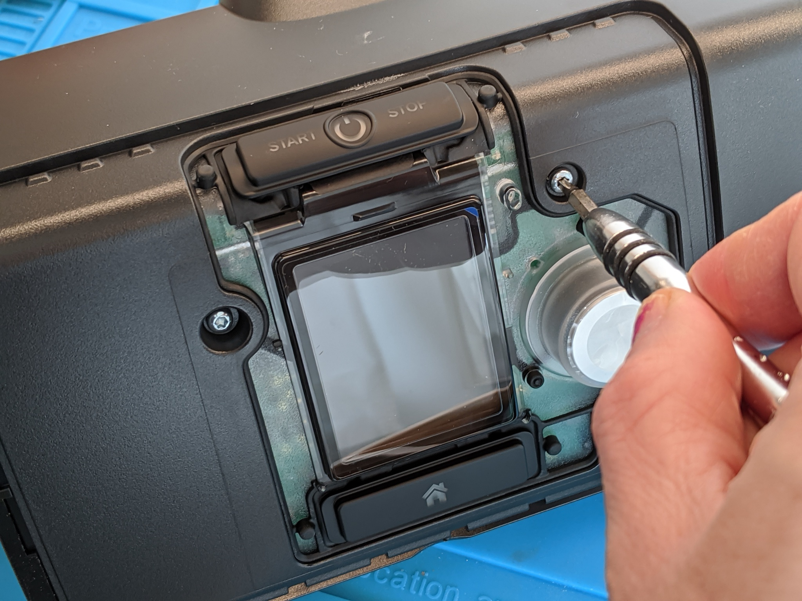
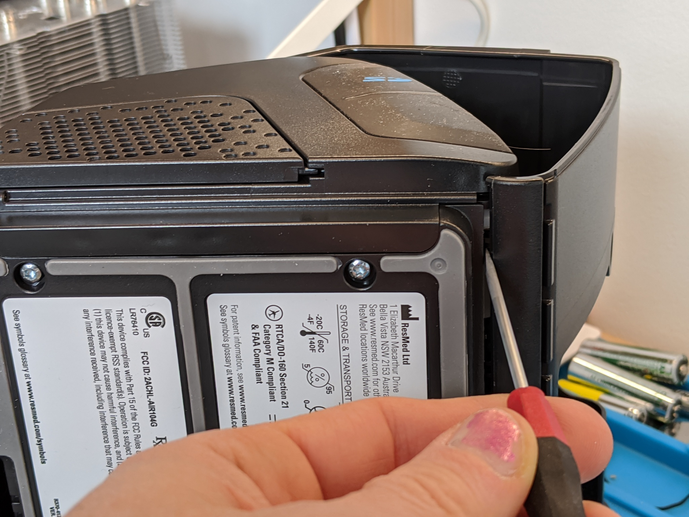
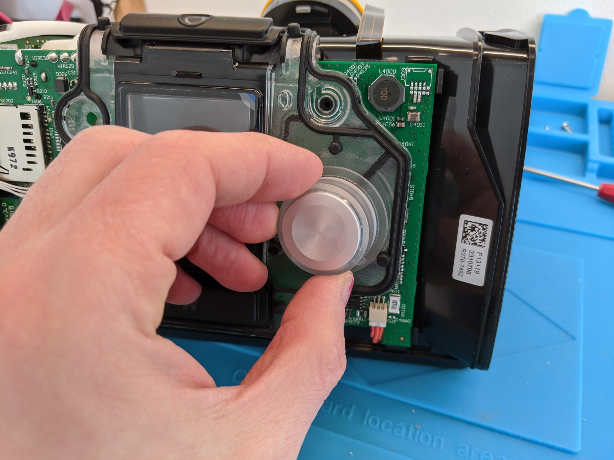
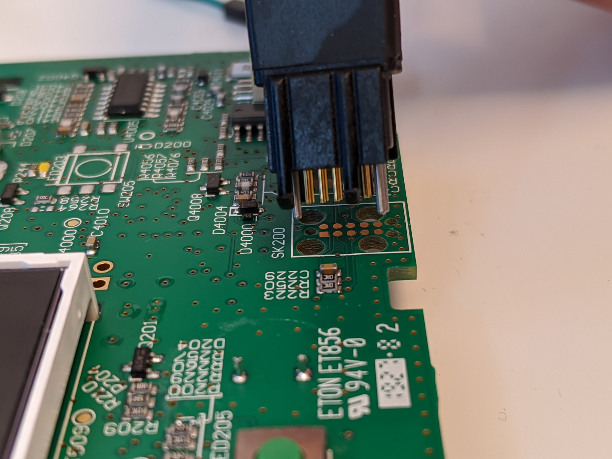
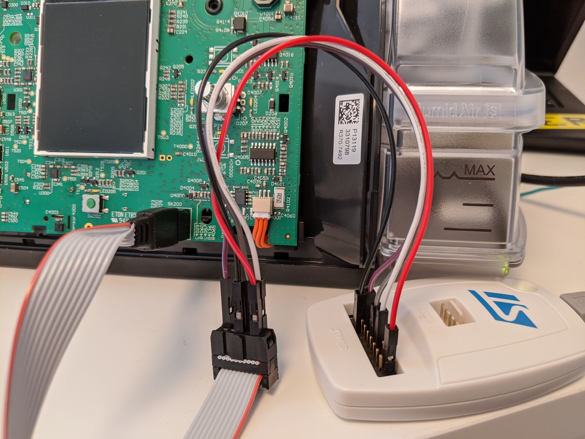
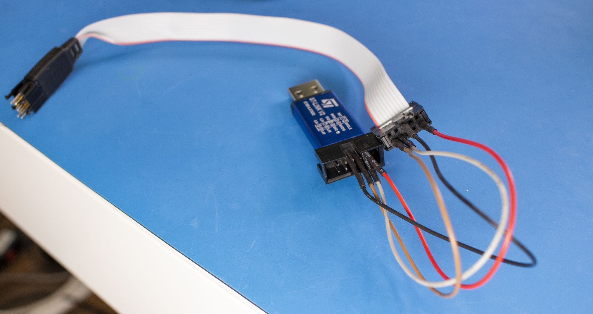
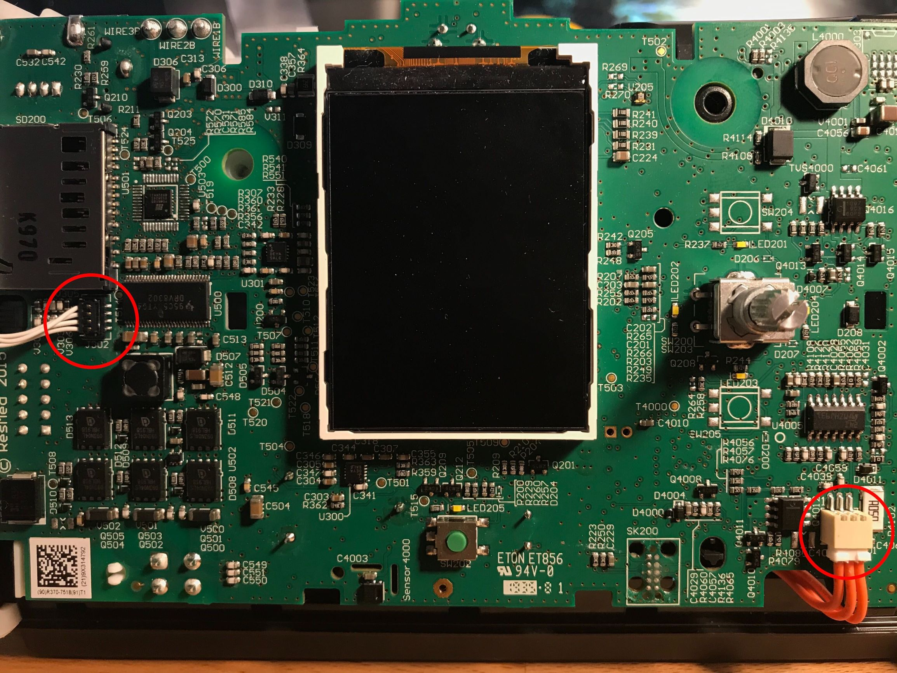

# Disassembly

In order to dump and replace the device firmware, we need to access the programming port. Unfortunately it is inside the machine so it requires some disassembly to reach.

### Tools

You will need the following:

* Torx T15
* [ST-Link/V2 STM32 programmer](https://www.digikey.com/product-detail/en/stmicroelectronics/ST-LINK-V2/497-10484-ND/2214535) or clone
* [TC2050-IDC](https://www.digikey.com/product-detail/en/TC2050-IDC/TC2050-IDC-ND/2605366) or [TC2050-ICD-NL](https://www.digikey.com/product-detail/en/tag-connect-llc/TC2050-IDC-NL/TC2050-IDC-NL-ND/2605367) programming adapter
* 4 male-female 0.1" jumpers
* Computer with [OpenOCD](http://openocd.org/) and some Unix familiarity
* `arm-none-eabi-gcc` to compile extensions (not necessary to unlock the device)

It is difficult but possible to solder directly to the PCB, which relaxes the requirement for the jumpers and programming adapter. For more information on this, see the [list of useful test points](info/testpoints.md).

First you'll need a Torx T15 driver to remove unscrew the three faceplate screws.

<!--  -->

The bottom latches need to be pried open with a flat head or a spudger.

The knob needs to be pulled firmly straight away from the board to remove it, which will allow
the gasket to be removed.  This can be done from the front-side by popping the latches at the bottom (which are accessible), then squeezing the two latches inward on the left and right-side of the gasket around the middle.  Be careful while popping it off the start button on the top of the device (see components list for the part number if replacement needed).
It is not necessary to remove the circuit board from the device.

## Wiring

[TC2050-IDC](https://www.digikey.com/product-detail/en/TC2050-IDC/TC2050-IDC-ND/2605366)
is useful for development since it has legs
that attach to the board.  For higher throughput flashing the
[TC2050-ICD-NL](https://www.digikey.com/product-detail/en/tag-connect-llc/TC2050-IDC-NL/TC2050-IDC-NL-ND/2605367)
is easier to hookup, but requires someone to hold it in place while the
device is reflashed with custom firmware.  The pinout of this port is not
the usual 10-pin ARM debug header; it combines the programming pins for
the STM32 that is the main controller, the auxiliary STM8, and the power watchdog IC.

Board footprint layout (you don't need this unless you're soldering to
the board):

| Function 		| Pin | Pin | Function |
| ---			| --- | --- | --- |
| `STM32_VDD`		| 1 (square) | 10 | `STM32_NRST` |
| `STM32_SWDIO/PMIC_TMS`| 2   | 9   | `STM8_SWIM` |
| `STM8_VDD`		| 3   | 8   | `PMIC_TDI` |
| `STM32_SWCLK/PMIC_TCK`| 4   | 7   | `STM8_NRST` |
| `GND`			| 5   | 6  | `PMIC_TDO` |

NOTE1: This follows the TC2050 pinout scheme, which is similar to "IC" pinouts (down one side, up the other).

NOTE2: The PMIC also shares some of the data pins.

The [ST-Link/V2 programming
device](https://www.digikey.nl/product-detail/en/stmicroelectronics/ST-LINK-V2/497-10484-ND/2214535)
is used for flashing and debugging the code on the STM32.  It has a
different pinout from the TC2050 cable, so it is necessary to use some
male-female 0.1" jumpers to connect the four STM32 programming pins on the
TC2050 to the STlink.

TC2050 ribbon cable pinout:

| Function 		| Pin | Pin | Function |
| ---			| --- | --- | --- |
| **`STM32_VDD`**	| 1 (red) | 2 | **`STM32_SWDIO`** |
| `STM8_VDD`		| 3   | 4   | **`STM32_SWCLK`** |
| **`GND`**		| 5   | 6  | `PMIC_TDO` |
| `STM8_NRST`		| 7   | 8   | `PMIC_TDI` |
| `STM8_SWIM`		| 9   | 10   | **`STM32_NRST`** |

STlink-V2 pinout:

| Function	 	| Pin | Pin | Function |
| ---			| --- | --- | --- |
| **`STM32_VDD`**	|  1  |  2  | NC |
| NC			|  3  |  4  | NC |
| NC			|  5  |  6  | NC |
| **`STM32_SWDIO`**	|  7  |  8  | NC |
| **`STM32_SWCLK`**	|  9  | 10  | NC |
| NC			| 11  | 12  | NC |
| NC			| 13  | 14  | NC |
| **`STM32_NRST`**	| 15  | 16  | NC |
| NC			| 17  | 18  | NC |
| NC			| 19  | 20  | **`GND`** |

!!! Warning
	A genuine ST-Link programmer uses the STM32_VDD pin to detect the target voltage, not to provide power. Connecting a generic programmer or a Raspberry Pi with this pin configuration will cause the programmer to be back-powered through the AirSense PCB.

	**If you are using a SWD programmer other than a genuine ST-Link, do not hook up STM32_VDD to your 3.3V pin or you may risk damaging your board, programmer, or both!**

The following image shows the connections with the typcal low-cost ST-Link (note no VCC!).

Finally, you may wish to disconnect the cellular daughterboard (circled, left) and
humidifier (circled, right) so that the device does not 'phone home' or attempt
to heat an empty water tank.

Okay, now you're ready to [flash the firmware!](firmware.md)
