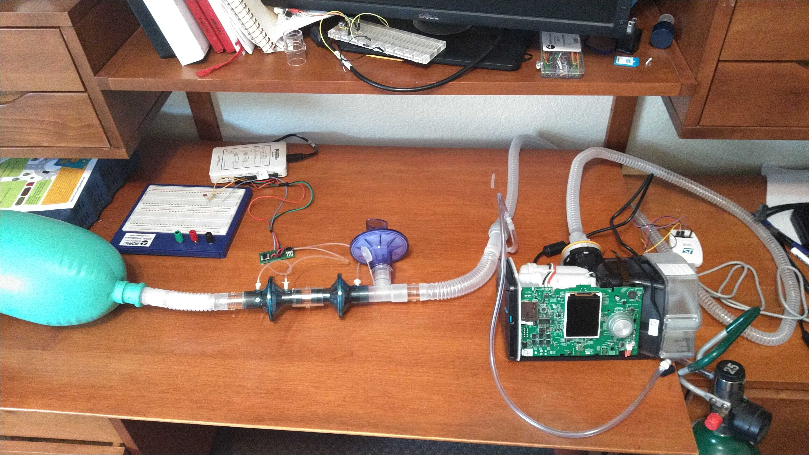

# Laboratory Evaluation

<!--
To be written.  Currently the modified firmware is being evaluated by
research labs and pulmnologists.  There are other pieces necessary to
use the devices in a clinical setting, such as virus filters, O2 inputs,
remote access consoles, alarms, etc.

provide a roadmap for how these modified CPAP devices could be used.

The UK's [Rapidly Manufactured Ventilator Standards](https://docs.google.com/spreadsheets/d/17EJ9TN6O1wqP4c-lIn5hbmuMRrto7M_KXHf17zjNSLk/edit#gid=704151435)
have criteria that should be met before this sort of modification can be deployed.

Does running the pump at 30 cm H2O cause a reduction in the
life of the machine?
-->

## Setup

The firmware release was flashed onto the unit and run through a
series of tests over the course of 3 days.  Maximum pressure, minimum
pressure, time at high pressure and time at low pressure were adjusted
and measurements made for a subset of the test conditions outlined in
[table 201.105 of ISO standard 80601-2-12](https://standard.no/Global/PDF/Koronakrisen%20tilgjengelig%20kostnadsfritt%202020/ISO80601-2-12_2020.pdf#page=44 "Particular requirements for basic safety and essential performance of critical care ventilators.").
A 3L bag designed to emulate the lung was salvaged from a consumables
kit used on an anesthesia machine.  The patient circuit was constructed
in accordance with the
[Mt. Sinai protocol to include a high resistance expiratory port and supplemental oxygen](https://health.mountsinai.org/wp-content/uploads/sites/14/2020/04/NIV-to-Ventilator-Modification-Protocol-v1.02-for-posting.pdf).
Air flow rate and pressure
were measured using Honeywell pressure chips and a National Instruments
data acquisition board.  Pressure was sent through a low pass filter and
calibrated using a standardized, adjustable pressure column at 0, 150
and 300 cm H2O.  Flow waveforms were acquired as a differential pressure
and calibrated using standard 0.6, 1 and 3 L syringes and integrated to
calculate tidal volumes using MATLAB.  A tube was filled with polymeric
stuffing until physiologic resistance was achieved.  Resistance and
compliance were calculated from the measured pressure volume loop.
Resistance was measured to be around 13.4 cm H2O/L/s and compliance was
measured to be 35.7 ml/cm H2O.   The test set-up is pictured in figure 1.

## Results

A few test cases are presented to illustrate the high end of the
performance range.  The unit was set to a maximum pressure of 30 cm H2O, a
minimum pressure of 4 cm H2O, high pressure time of 1 second (inspiration)
and low pressure time of 2 seconds (expiration).  Results are plotted in figure 2.
Tidal volumes were calculated to be 629 ± 0.80 mL.  The system took
approximately 5 minutes to equilibrate and held stable for > 24 hours.
Peak pressures were centered around the set point of 30 cm H2O with a
range of approximately 29-32 cm H2O while minimum pressures were also
centered around the setpoint of 5 cm H2O with a range of approximately 4-6
cm H2O.  Supplemental oxygen was then supplied at a rates of 10, 15 and
20 liters per minute.  Linear increases in tidal volume were observed.
At 15 L/min of oxygen, the tidal volume increased by approximately 20 mL.  

Next steps in validation are to compare time series data from the unit
with measured values.  These tests were done anecdotally but should be
further characterized.  Pressures measured experimentally aligned well
with those reported by the unit.  Flow (tidal volume) measurements made
experimentally appear to be higher than those reported by the unit.
This could be expected due to measurement error along with the patient
circuit between the unit’s flow sensor and the experimental transducers.
Initial data indicated tidal volumes at the test lung are approximately
20% higher than those reported by the unit.  Further investigation and
characterization is warranted.

