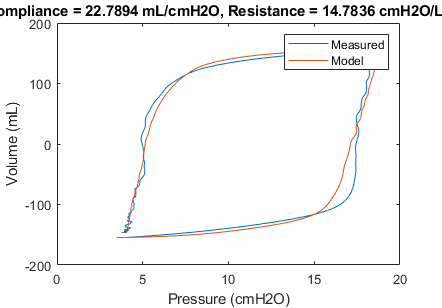

# Clinical Evaluation

To be written.  Currently the modified firmware is being evaluated by
research labs and pulmnologists.  There are other pieces necessary to
use the devices in a clinical setting, such as virus filters, O2 inputs,
remote access consoles, alarms, etc.

[Mt Sinai's BiPAP protocols for non-invasive ventilation](https://health.mountsinai.org/wp-content/uploads/sites/14/2020/04/NIV-to-Ventilator-Modification-Protocol-v1.02-for-posting.pdf)
provide a roadmap for how these modified CPAP devices could be used.

The UK's [Rapidly Manufactured Ventilator Standards](https://docs.google.com/spreadsheets/d/17EJ9TN6O1wqP4c-lIn5hbmuMRrto7M_KXHf17zjNSLk/edit#gid=704151435)
have criteria that should be met before this sort of modification can be deployed.

Does running the pump at 30 cm H2O cause a reduction in the
life of the machine?
