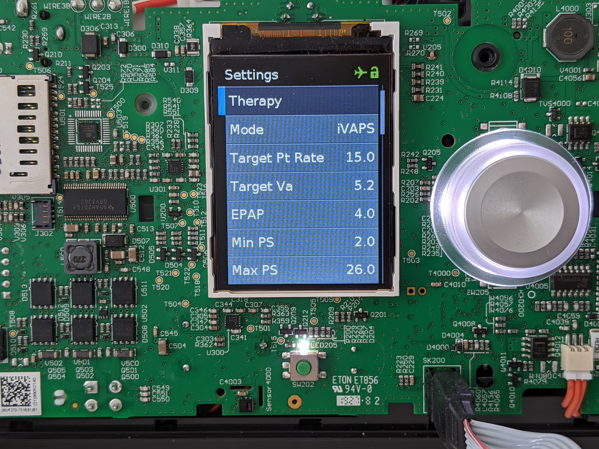

# Firmware 

### Connecting to Device

!!! Note
	If you are using Windows, the steps in this section
	will be slightly different. Please see the [Windows
	guide](info/windows.md) for more information.

We are going to use the open-source [OpenOCD](http://openocd.org) debug
interface to access the device.

First, make sure [this repository](https://github.com/osresearch/airbreak)
is cloned and set to your current working directory.

Make sure your programmer is [attached to the PCB](/disassembly/#wiring),
then start OpenOCD.  If you are using a programmer other than the STlink, you
will need to select the correct interface.

```sh
sudo openocd -f interface/stlink.cfg -f 'tcl/airsense.cfg'
```

If your device is connected properly, you should see a bunch of output, ending with:
```sh
Info : stm32f4x.cpu: hardware has 6 breakpoints, 4 watchpoints
```

In another terminal, connect to the OpenOCD server:

```sh
telnet localhost 4444
```

Once your OpenOCD console is successfully connected, you can continue to the next step.

## Dumping Vendor Firmware

!!! Warning
	This step is mandatory. Each subsequent step requires an
	original copy of the device firmware to be present in the working
	directory. With an original copy of the firmware, the device can
	always be restored to factory settings. If you lose the original
	firmware, you risk bricking your device!

Type `dump` into the OpenOCD console.  It will take several seconds for
all of the different regions to be copied from the device and deposited
into the `stm32/` subdirectory.


## Building Alternate Firmware


## Flashing


In a third terminal window, patch the extracted firmware in
`stm32/bank0.bin` with the `patch-airsense` script.  This will will
unlock the vendor modes and configuration bits.

```
./patch-airsense stm32/bank0.bin stm32-unlocked.bin
```

The script might fail if the hashes of your extracted firmware do not
match the one that it expects (currently `SX567-0401`). If you have a
different version, please contact us for how to procede.

Now reflash the device with the modified firmware by going back to the
OpenOCD console terminal and running:

```sh
stm32f2x options_write 0 0x2c
reset halt
flash write_image erase stm32-unlocked.bin 0x8000000
reset run
```

The `write_image` step takes around 20 seconds and the device should
reboot afterwards.

## Testing



After the device has been reflashed and rebooted, you can enter the
clinician menu (hold down the `Home` button while pushing on the knob
for three seconds), and you should be able to select from all of the vendor
modes, including iVAPS and ST.  These modes potentially allow the CPAP device
to immediately be used according to the Mt Sinai BiPAP protocol.

The flashing is a one-time operation.  The programmer can be unplugged and moved to another device.

## Restoring the vendor firmware


In order for the vendor firmware to flash properly, it is necessary
to restore variables to the device's backup memory in a certain sequence.
The following OpenOCD command will do that:
```sh
flash_new stm32.bin
```

