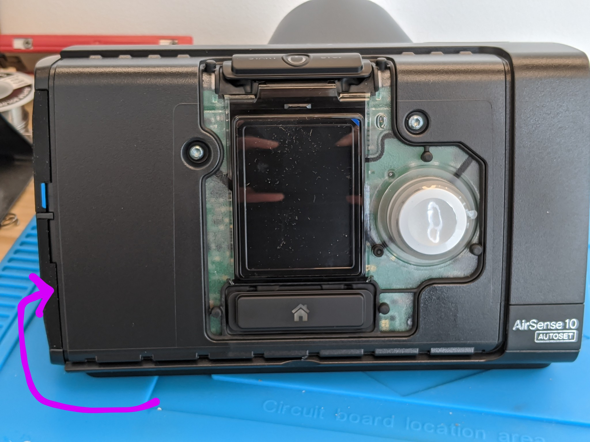

# Jailbreak CPAP machines to make temporary ventilators

The Airsense 10 CPAP machine is a low cost sleep therapy device that
provides a constant pressure to help with sleep apnea and other disorders.
The manufacturer says it "[would require significant rework in order
to function as a ventilator](https://www.resmed.com/en-us/covid-19/)",
although they do not offer a way to do so.  What we have done instead
it to "*jailbreak*" the device so that it is possible to run additional processes on the
device in a way similar to [Magic Lantern](https://magiclantern.fm).
This makes it feasible to add the features necessary to use the CPAP machine
as a temporary ventilator to help ease the shortage
until more ventilators are available.  This process also unlocks all of
the modes and configuration parameters available in the vendor firmware.

## Major feature:
* Closed loop air volume control with backup respiration rates
* Allows maximum pressure to be increased to 30 cm H2O
* Adds a timed breathing mode that oscillates between high and low pressure
* Allows very rapid pressure change rates compared to the stock slow ramp 0.2 cm/sec
* Reads tuning parameters from a memory location accessible over SWD
* Unlocks all of the vendor modes and tunable configuration parameters

## Possible new features:
* Draws graphs on the screen to show an immediate history of data (almost ready)
* Visual and audible alarms when flow stoppage or leakage rates are detected
* GPIO interface with other systems


# Evaluation


To be written.


# Installation


You'll need a Torx T15 driver to remove unscrew the three faceplate screws.

<!--  -->


The bottom latches need to be pried open with a flat head or a spudger.


The knob needs to be pulled firmly straight away from the board to remove it, which will allow
the gasket to be removed.  Be careful while popping it off the start button on the top of the device.


[TC2050-IDC](https://www.digikey.com/product-detail/en/TC2050-IDC/TC2050-IDC-ND/2605366)
is useful for development since it has legs
that attach to the board.  For higher throughput flashing the
[TC2050-ICD-NL](https://www.digikey.com/product-detail/en/tag-connect-llc/TC2050-IDC-NL/TC2050-IDC-NL-ND/2605367)
is easier to hookup, but requires someone to hold it in place while the
device is reflashed with custom firmware.  The pinout of this port is not
the usual 10-pin ARM debug header; it combines the programming pins for
the STM32 that is the main controller, the auxillary STM8, and the PMIC.

Board footprint layout (you don't need this unless you're soldering to
the board):

| Function 		| Pin | Pin | Function |
| ---			| --- | --- | --- |
| `STM32_VDD`		| 1 (square) | 2 | `STM32_NRST` |
| `STM32_SWDIO`		| 3   | 4   | `STM8_SWIM` |
| `STM8_VDD`		| 5   | 6   | `PMIC_TDI` |
| `STM32_SWCLK`		| 7   | 8   | `STM8_TLI` |
| `GND`			| 9   | 10  | `PMIC_TDO` |


The [ST-Link/V2 programming
device](https://www.digikey.nl/product-detail/en/stmicroelectronics/ST-LINK-V2/497-10484-ND/2214535)
is used for flashing and debugging the code on the STM32.  It has a
different pinout from the TC2050 cable, so it is necessary to use some
male-female 0.1" jumpers to connect the four STM32 programming pins on the
TC2050 to the STlink.

TC2050 ribbon cable pinout:

| Function 		| Pin | Pin | Function |
| ---			| --- | --- | --- |
| **`STM32_VDD`**	| 1 (red) | 3 | **`STM32_SWDIO`** |
| `STM8_VDD`		| 5   | 7   | **`STM32_SWCLK`** |
| **`GND`**		| 9   | 10  | `PMIC_TDO` |
| `STM8_TLI`		| 8   | 6   | `PMIC_TDI` |
| `STM8_SWIM`		| 4   | 2   | **`STM32_NRST`** |

STlink-V2 pinout:

| Function	 	| Pin | Pin | Function |
| ---			| --- | --- | --- |
| **`STM32_VDD`**	|  1  |  2  | NC |
| NC			|  3  |  4  | NC |
| NC			|  5  |  6  | NC |
| **`STM32_SWDIO`**	|  7  |  8  | NC |
| **`STM32_SWCLK`**	|  9  | 10  | NC |
| NC			| 11  | 12  | NC |
| NC			| 13  | 14  | NC |
| **`STM32_NRST`**	| 15  | 16  | NC |
| NC			| 17  | 18  | NC |
| NC			| 19  | 20  | **`GND`** |


# Flashing

With the device powered up and the stlink connected to the computer, run [OpenOCD](http://openocd.org/)
to initialize the programmer and fetch the existing firmware (should take about 10 seconds):

```
sudo openocd \
	-f interface/stlink.cfg \
	-f target/stm32f4x.cfg \
	-c 'flash read_bank 0 stm32.bin'
```

Patch this extracted firmware with the script [`patch-airsense` script](patch-airsense)
that will unlock the vendor modes and configuration bits:

```
./patch-airsense stm32.bin stm32-unlocked.bin
```

Now reflash the device with the modified firmware:

```
sudo openocd \
	-f interface/stlink.cfg \
	-f target/stm32f4x.cfg \
	-c 'stm32f2x options_write 0 0x2c' \
	-c 'reset halt' \
	-c 'flash write_image erase stm32-unlocked.bin 0x8000000' \
	-c 'reset run' \
```


# Writing extensions

To be written.
