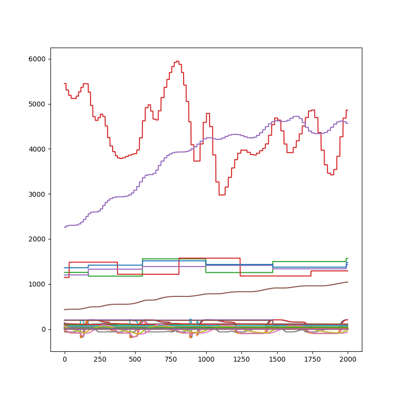

# Python Scripts and Things

## Firmware Patcher

The python based firmware patcher implements most of the functionality from the bash based script. It also adds:

* Patches boot logos.
* Patches in serial monitor code.

Note it's currently partially a 'port' of the bash script, so it just has calls in the main file which more closely mirror the bash script.

## ASMonitor in Serial

This is a simple method of doing read/writes to system memory. For example:

	from asmonitor_serial import ASSerialMonitor 

    AS = ASSerialMonitor()
    AS.open("COM57")

	#Should be nothing at this address so safe...
	AS.write_mem32(0x20001F00, 0x11223344)
	
    base = 0x20000000
    for i in range(0, 1000, 4):
        print("%08X: %08X"%(0x20000000+i, (AS.read_mem32(0x20000000+i))))

    #Read a float
    for i in range(0, 1000):
        print(AS.read_float(0x200157cc))

	AS.close()

If you want to update in a terminal, you can `pip install colorama` for cross-platform support that works even on Windows. Just do something like this to plot a floating-point variable from some memory location:

	import sys
	import time
	from colorama import init
	from asmonitor_serial import ASSerialMonitor 
	
	init()
	
	AS = ASSerialMonitor()
	AS.open("COM57")
	
	while True:
	    val = AS.read_float(0x200157cc)
	    val = str(val)
	    print('\033[2J')
	    print(val)
	    time.sleep(0.01)
    

## ASMonitor (High-Level)

This high-level library provides a slightly more generic way to perform reads from memory, using either the serial monitor patch or a J-Link (openocd etc should also work but needs to be added).

Note that the J-Link has VERY HIGH throughput - you can easily dump the entire variable table for example. If using the serial monitor you should ensure you are only reading actual variables needed!

### Plotting Example
	
If using J-Link, you can plot full variable tables. Here's a simple example:

	import matplotlib.pylab as plt
	import numpy as np
	from asmonitor import ASMonitor, ASMonitor_JLink
	
	print("Connecting to low-level...")
	asjl = ASMonitor_JLink()
	asjl.connect()
	
	asm = ASMonitor(asjl)
	
	samples = 2000
	
	floatarrays = np.zeros( (samples, 255))
	
	print("Starting to sample now - ensure airflow on and unit is working")
	#Dump 255 variables from table (how many are there?)
	for i in range(0, samples):
	    floatarrays[i,:] = asm.return_therapy_float(num_fps=255)
	    
	plt.plot(floatarrays)
	plt.show()

Which generates a graph of everything at once:

You can use standard Python plotting libraries, and/or Jupyter as well. This allows you to do real-time plotting etc.

See examples for similar thing using serial monitor (but with less variables plotted due to more limited speeds).